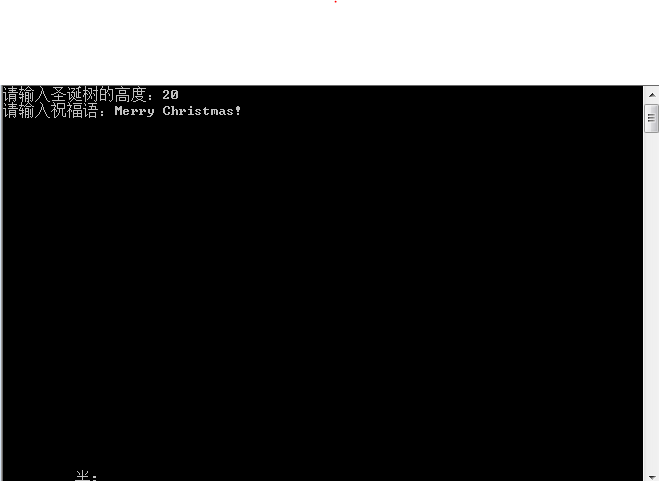
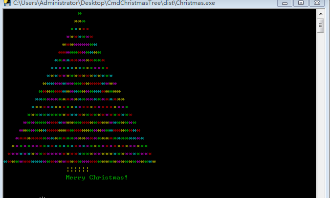

# CmdChristmasTree

## Introduction

 A Colorful Christmas Tree generated in CMD console.

## Feature

1. Run "Christmas.exe".

2. Input tree's <u>height</u> and <u>greeting text.</u>

3. Then you will get a shining Christmas tree (will keep refreshing) with your greeting text below.

4. Press "**enter**" to quit the program anytime you want.

## Notice

The program is generated purely by **ChatGPT-3.5**, program logic designed by me. Anyone can use it freely or build more funny trees based on the source codes.

## Dependency

No dependency needed for released executable.

For source code, I'm using **python-3.7** and have packages below:

- colorama 0.3.9

- keyboard 0.13.5

## Program Screenshot

 

